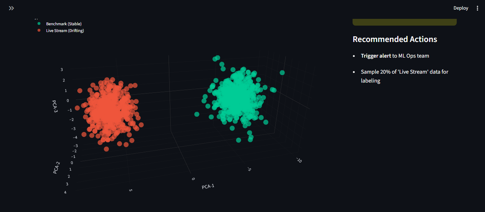

# 📉 Benchmark Bias Drift Detector


## 📑 Abstract

**Dataset decay is the silent killer of AI models.**

State-of-the-art computer vision models trained on static benchmarks (e.g., ImageNet, COCO) suffer from **Concept Drift** and **Covariate Shift** when deployed in dynamic real-world environments.

This repository hosts a **3D Spectral Analysis Tool** designed to audit "Model Aging." By visualizing high-dimensional embeddings using Principal Component Analysis (PCA) and calculating the **Wasserstein Distance** between reference benchmarks and live data streams, this tool provides a statistical "Health Score" for deployed AI systems.

---

## 📸 3D Embedding Visualization

> *Interactive 3D projection showing the semantic separation between the 2020 Benchmark (Green) and 2026 Live Data (Red).*



*(Ensure you have an image named `drift_demo.png` in your repository)*

---

## ⚡ Key Capabilities

* **📊 3D Dimensionality Reduction:** Projects 50-dimensional feature vectors into an interactive 3D space using PCA, revealing hidden separation planes that 2D plots miss.
* **📉 Wasserstein Metric (EMD):** Uses the "Earth Mover's Distance" to calculate a robust, scalar Drift Score (0-100) that is insensitive to minor noise but highly sensitive to structural distribution shifts.
* **🩺 Automated Health Diagnostics:** The system analyzes the drift magnitude and automatically issues "Rollback" or "Retrain" recommendations based on industry-standard thresholds.
* **🔍 Context-Aware Hover:** Simulates metadata inspections (e.g., `train_img_045.jpg` vs `live_stream_992.jpg`) for granular auditing.

---

## 🛠️ Installation & Usage

### 1. Clone the Lab Environment
```bash
git clone https://github.com/yourusername/benchmark_drift_detector.git
cd benchmark_drift_detector
```

### 2. Install Research Dependencies
```bash
pip install -r requirements.txt
```

### 3. Launch the Analysis Engine
```bash
python -m streamlit run app.py
```

## 🧠 Mathematical Foundation
The core drift quantification relies on the Wasserstein-1 Distance ($W_1$), which measures the minimum "work" required to transform the distribution of the Live Data ($Q$) into the Benchmark Data ($P$).

$$ W_1(P, Q) = \inf_{\gamma \in \Pi(P, Q)} \mathbb{E}_{(x, y) \sim \gamma} [| x - y |] $$

Where:
* $P$ = Probability distribution of the Training Benchmark.
* $Q$ = Probability distribution of the Incoming Data Stream.
* $\Pi(P, Q)$ = Set of all joint distributions $\gamma(x, y)$ whose marginals are $P$ and $Q$.

Unlike KL-Divergence, Wasserstein Distance provides a meaningful metric even when the support of the two distributions does not overlap.

## 📂 Repository Structure
```plaintext
📁 benchmark_drift_detector
│
├── 📄 app.py              # Main Streamlit Application (3D Viz Engine)
├── 📄 requirements.txt    # SciPy, Sklearn, Plotly dependencies
├── 📄 README.md           # Documentation
└── 🖼️ drift_demo.png      # Visualization Evidence
```

Built for AI Safety & Robustness Research 
Kshirja Mehra  | 2026
